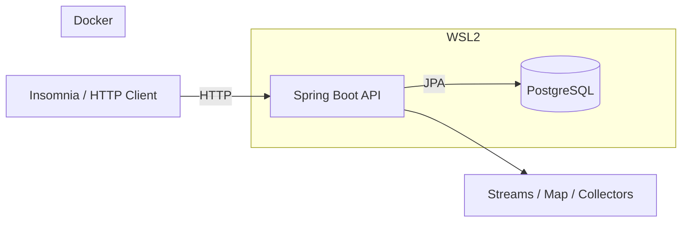

# Estudo API – Spring Boot + Docker + WSL2

Projeto de estudo para **Java (Streams, Map, Collectors)** com **Spring Boot**, rodando em **Docker**, usando **WSL2** e testado via **Insomnia / HTTP**.

---

## 📦 Tecnologias

- Java 21
- Spring Boot
- Spring Data JPA
- Docker / Docker Compose
- PostgreSQL
- WSL2
- VS Code

---

## 🧭 Diagrama simples da arquitetura



---

## 📁 Estrutura do projeto

```
meu-estudo-api/
├── docker-compose.yml
├── Dockerfile
├── README.md
└── src/
    └── main/
        ├── java/
        └── resources/
```

---

## 🚀 Subir o projeto (WSL2)

⚠️ **Tudo deve ser executado dentro do WSL**, não no Windows.

No terminal do WSL, na raiz do projeto:

```bash
docker compose up -d --build
docker compose ps
docker logs -f estudo_api
```

---

## ☕ Java no WSL (obrigatório)

O Java **não pode** estar só no Windows.  
Ele **precisa existir dentro do WSL**.

### Instalação

```bash
sudo apt install -y openjdk-21-jdk
java -version
```

### Configurar `JAVA_HOME`

```bash
echo 'export JAVA_HOME=/usr/lib/jvm/java-21-openjdk-amd64' >> ~/.bashrc
echo 'export PATH=$JAVA_HOME/bin:$PATH' >> ~/.bashrc
source ~/.bashrc
```

### Verificação

```bash
echo $JAVA_HOME
javac -version
```

---

## 🧪 Endpoints disponíveis

### 🔹 Listar pessoas
```http
GET http://localhost:8080/pessoas
```

### 🔹 Pessoas agrupadas por idade
```http
GET http://localhost:8080/pessoas/agrupadas-por-idade
```

### 🔹 Criar pessoa
```http
POST http://localhost:8080/pessoas
Content-Type: application/json

{
  "nome": "Neide",
  "idade": 40
}
```

---

## 🛠 VS Code – Extensões obrigatórias

Instale **nessa ordem** (sem inventar moda):

- **WSL** (Microsoft)
- **Docker** (Microsoft)
- **Extension Pack for Java** (Microsoft)

O pacote Java já inclui:
- Language Support for Java
- Debugger for Java
- Maven for Java
- Test Runner for Java
- Project Manager for Java

---

## ⚙️ Configuração recomendada do VS Code

Abra:  
`Ctrl + Shift + P → Preferences: Open Settings (JSON)`

```json
{
  "java.configuration.updateBuildConfiguration": "automatic",
  "java.compile.nullAnalysis.mode": "automatic",
  "java.autobuild.enabled": true,

  "editor.formatOnSave": true,
  "editor.codeActionsOnSave": {
    "source.organizeImports": "explicit"
  },

  "files.exclude": {
    "**/.classpath": true,
    "**/.project": true,
    "**/.settings": true
  },

  "terminal.integrated.defaultProfile.linux": "bash"
}
```

---

## 🧠 Objetivo do projeto

- Praticar:
  - `Stream`
  - `map`
  - `filter`
  - `collect`
  - `groupingBy`
- Integrar Java moderno com Spring Boot
- Rodar tudo em ambiente isolado (Docker + WSL)
- Testar via chamadas HTTP simples

---

## 🧩 Observações importantes

- ❌ Não instale Java só no Windows achando que resolve
- ✅ Sempre abra o projeto no VS Code via **WSL**
- ✅ Use `docker logs` para debugar
- ✅ Banco é persistente via Docker volume
